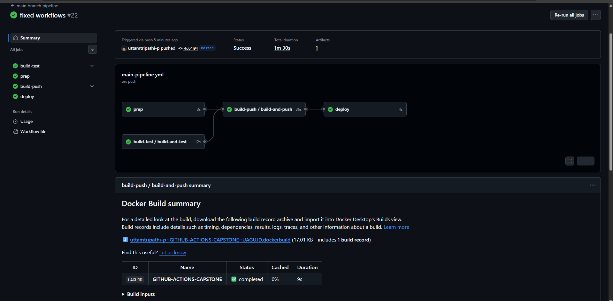

# pipeline architecture

# workflow files(.yml)
## main-pipeline.yml
```yaml
 name: main branch pipeline

 on:
  push:
    branches: [master]

jobs:
  build-test:
    uses: ./.github/workflows/reusable-build-test.yml
    with:
      run_tests: true

  prep:
    runs-on: ubuntu-latest
    outputs:
      short_sha: ${{ steps.vars.outputs.short_sha }}
    steps:
      - id: vars
        run: echo "short_sha=$(echo $GITHUB_SHA | cut -c1-7)" >> $GITHUB_OUTPUT

  build-push:
    uses: ./.github/workflows/reusable-docker.yml
    needs: [ prep,build-test ]
    with:
      image_name: ${{ github.event.repository.name }}
      tag: ${{ needs.prep.outputs.short_sha }}
    secrets:
      docker_username: ${{ secrets.DOCKER_USERNAME }}
      docker_token: ${{ secrets.DOCKER_TOKEN }}

  deploy: 
    runs-on: ubuntu-latest
    needs: [build-push, prep]
    environment: environment
    steps:
      - name: deploy message
        run: |  
          echo "Deploying image: ${{ secrets.DOCKER_USERNAME }}/github-actions-capstone:${{ needs.prep.outputs.short_sha }}"
      - name: environment info
        run: |
          echo "The environment being used is : ${{ vars.SITE }}"
      - name: success message
        if: success()
run: echo "SUCCESSFULL"
```
## health-check.yml

```yaml
name: health check
on:
  workflow_dispatch:
  schedule:
    - cron: '0 */12 * * *'

jobs:
  pull_image:
    runs-on: ubuntu-latest
    outputs:
      health_check_result: ${{ steps.summary.outputs.github_output }}
    steps:
      - name: pull image
        run: |
          docker pull ${{ secrets.DOCKER_USERNAME }}/github-actions-capstone:latest

      - name: run container
        run: |
          docker rm -f health_check_container || true
          docker run -d -p 5000:5000 --name health_check_container \
            ${{ secrets.DOCKER_USERNAME }}/github-actions-capstone:latest

      - name: healthcheck after waiting 5 seconds
        run: |
          sleep 5
          if curl -sf http://localhost:5000/health; then
            echo "Health check passed"
          else
            echo "Health check failed"
            exit 1
          fi

      - name: cleanup
        if: always()                   # ✅ always runs
        run: |
          docker rm -f health_check_container || true

      - name: summary step
        id: summary
        if: always()                   # ✅ always runs
        run: |
          if [ "${{ job.status }}" == "success" ]; then
            STATUS="PASSED ✅"
          else
            STATUS="FAILED ❌"
          fi
          echo "## Health Check Report" >> $GITHUB_STEP_SUMMARY
          echo "- Image: ${{ secrets.DOCKER_USERNAME }}/github-actions-capstone:latest" >> $GITHUB_STEP_SUMMARY
          echo "- Status: $STATUS" >> $GITHUB_STEP_SUMMARY
          echo "- Time: $(date)" >> $GITHUB_STEP_SUMMARY
          echo "github_output=$STATUS" >> $GITHUB_OUTPUT
```
## pr-pipeline.yml

```yaml
name: pull requests pipeline
on: 
  pull_request:
    branches: [master]
    types: [ opened , synchronize]

jobs:
  pr-pipeline:
    uses: ./.github/workflows/reusable-build-test.yml
    with:
      run_tests: true
  pr-comment:
    runs-on: ubuntu-latest
    needs: pr-pipeline
    steps:
      - name: pr checks
        run: |
          echo "PR checks passed for branch: ${{ github.ref }}"
```

## reusable-build-test.yml

```yaml
name: reusable worfklow build & test
on:
  workflow_call:
    inputs:
      python_version:
        description: "python version to use"
        default: "3.13"
        required: false
        type: string
      run_tests: 
        description: "Tests to run"
        type: boolean
        default: true
        required: false
    outputs:
      test-result:
        description: "Test value passed or failed"
        value: ${{ jobs.build-and-test.outputs.test_result }}

jobs:
  build-and-test:
    runs-on: ubuntu-latest
    outputs:
      test_result: ${{ steps.set_result.outputs.test_result }}
    steps:
      - name: code checkout
        uses: actions/checkout@v4
      - name: setup language runtime
        uses: actions/setup-python@v5
        with:
          python-version: ${{ inputs.python_version }}
      - name: installing dependencies
        run: |
          pip install -r requirements.txt 
          pip install -r requirements-cicd.txt
      - name: run tests
        id: run_tests 
        if: ${{ inputs.run_tests }}
        run: |
          flake8 app.py
      - name: set output
        id: set_result
        if: always()
        run: |
          if [[ "${{ steps.run_tests.outcome }}" == "success" || "${{ steps.run_tests.outcome }}" == "skipped" ]]; then
            echo "test_result=passed" >> $GITHUB_OUTPUT
          else
            echo "test_result=failed" >> $GITHUB_OUTPUT
          fi
```
## reuable-docker.yml
```yaml
name: reusable workflow docker build & push
on:
  workflow_call:
    inputs:
      image_name:
        description: "name of image"
        required: true
        type: string
      tag:
        description: "tag of the image"
        required: true
        type: string
    outputs:
      image_url: 
        description: "full image path"
        value: ${{ jobs.build-and-push.outputs.image_url }}

    secrets:
      docker_username:
        description: "dockerhub username"
        required: true
      docker_token: 
        description: "dockerhub secret token"
        required: true


jobs:
  build-and-push:
    runs-on: ubuntu-latest
    outputs:
      image_url: ${{ steps.image_url.outputs.image_url }}
    steps:
      - name: checkout code
        uses: actions/checkout@v4

      - name: set lowercase image name        # ✅ add this step
        id: image
        run: |
          echo "name=$(echo '${{ inputs.image_name }}' | tr '[:upper:]' '[:lower:]')" >> $GITHUB_OUTPUT

      - name: login to docker hub
        uses: docker/login-action@v3
        with:
          username: ${{ secrets.docker_username }}
          password: ${{ secrets.docker_token }}

      - name: build and push
        uses: docker/build-push-action@v6
        with:
          context: .
          push: true
          tags: |
            ${{ secrets.docker_username }}/${{ steps.image.outputs.name }}:latest
            ${{ secrets.docker_username }}/${{ steps.image.outputs.name }}:${{ inputs.tag }}

      - name: image url output
        id: image_url
        if: success()
        run: |
          echo "image_url=${{ secrets.docker_username }}/${{ steps.image.outputs.name }}:${{ inputs.tag }}" >> $GITHUB_OUTPUT
```

# Screenshot of a PR running the test-only pipeline


.png)


# Screenshot of a main branch push running the full pipeline





# Docker Hub link to your pushed image
## https://hub.docker.com/repository/docker/uttamtripathi/github-actions-capstone


# What I'll improve next

## Currently my app deploys even without my manual approval
## So next time I'll improve this


