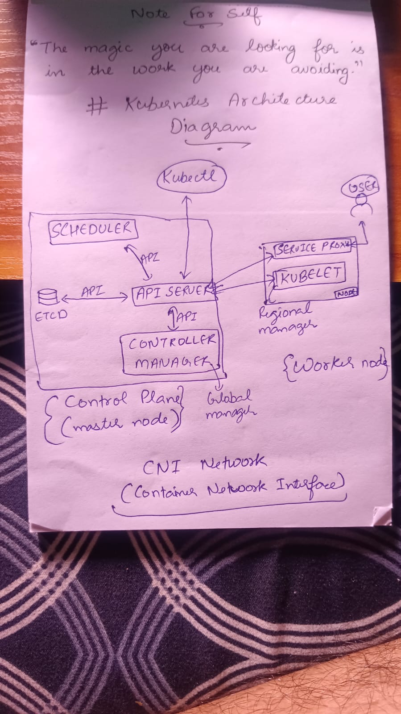

# Architecture diagram
## 

# kubectl get nodes & kubectl get pods
## 

# Why was Kubernetes created? What problem does it solve that Docker alone cannot?
## Kubernetes was created because Docker alone cannot manage hundreds of containers across multiple hosts, cannot auto-heal failed containers, cannot do load balancing, and cannot scale them automatically based on traffic/load.

# Who created Kubernetes and what was it inspired by?
## Kubernetes was created by Google, inspired by their internal system called Borg (which Google used to manage their own infrastructure), and was open-sourced in 2014 so that others could also contribute.

# What does the name "Kubernetes" mean?
## It means Helmsman or Pilot (the person who steers a ship) in Greek. That's why the Kubernetes logo is a ship's wheel.

