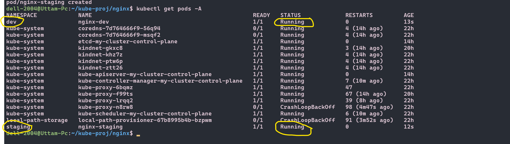

# Important screenshots of today's session
-1.png)

-1.png)

-1.png)




```yml
# namespace.yml
kind: Namespace
apiVersion: v1
metadata:
  name: production
```


## Deployment manifest with explanation
```yml
# deployment.yml
kind: Deployment # what resource to create
apiVersion: apps/v1 # which api group the source belongs
metadata: # identity/info of resourece
  name: nginx-deployment # What name to give
  namespace: dev # which namespace will it belong
  labels: # these are like identification mark
    app: nginx
spec: # deployment's information of what to create like replicas and pod template
  replicas: 5 
  selector:
    matchLabels: # find and own pods that have these labels
      app: nginx # Label to use
  template: # blueprint for creating each pod
    metadata: # identity of each pod that gets created
      labels:
        app: nginx # every pod gets this label

    spec: # specification of container
      containers: 
      - name: nginx # name of conatiner
        image: nginx:1.24 # Image to use 
        ports: # ports on which conatiner will run
        - containerPort: 80 
```

## What namespaces are and why you would use them?
### namespaces are like different environment inside the cluster. Like different rooms inside a house, so that our request doesn't get in wrong room.
### we use them to avoid name conflicts, two teams can have same pod named 'nginx' as long as they are in different namespace.

## What happens when you delete a Pod managed by a Deployment vs a standalone Pod?
### The pod get recreated if deleted from deployment as the manifest will maintain the desired state by creating Replicasets.
## A Deployment creates one (or more during updates) ReplicaSet, and the ReplicaSet maintains the desired number of Pods. 
### But in case of standalone pod it will not be recreated.

## How scaling works (both imperative and declarative)
### Imperative scaling → you manually run a command (like kubectl scale) to change replicas right now. No automation.
### Declarative scaling → you define desired state in YAML (replicas: 3), and Kubernetes ensures it stays that way.

## How rolling updates and rollbacks work
### In a rolling update, old pods keep running while creating new pods and after successfull creation,old pods gets deleted.
### Rollback = going back to a previous working version of your Deployment.
### How it actually works
#### Every time you update a Deployment, Kubernetes keeps revision history (ReplicaSets)
#### If the new version is broken, you can revert to a previous ReplicaSet


