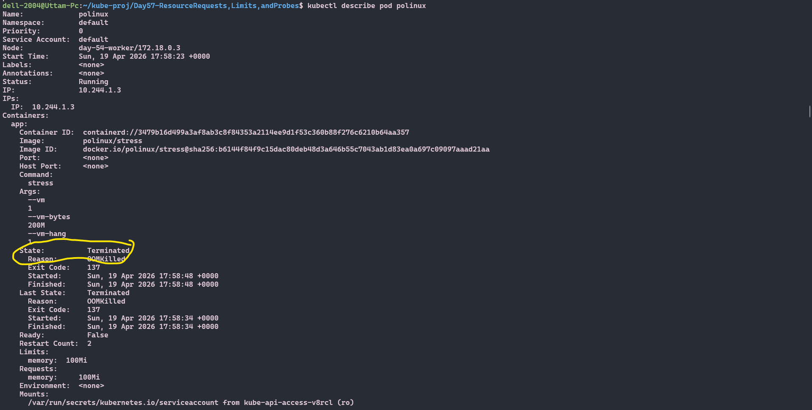

# Day 57 — Kubernetes Resource Management & Probes

> 90 Days of DevOps | Uttam Tripathi | CSJMU Kanpur

---

## 📌 Table of Contents

1. [Requests vs Limits](#1-requests-vs-limits)
2. [What Happens When Limits Are Exceeded](#2-what-happens-when-limits-are-exceeded)
3. [Liveness vs Readiness vs Startup Probes](#3-liveness-vs-readiness-vs-startup-probes)
4. [Hands-on Demo Results](#4-hands-on-demo-results)
5. [Screenshots & Observations](#5-screenshots--observations)
6. [Key Takeaways](#6-key-takeaways)

---

## 1. Requests vs Limits

### What are they?

```yaml
resources:
  requests:
    memory: "128Mi"   # used for SCHEDULING
    cpu: "100m"
  limits:
    memory: "256Mi"   # used for ENFORCEMENT
    cpu: "250m"
```

### Requests — Scheduling

- Used by the **Kubernetes Scheduler** to decide **which node** to place the pod on
- The scheduler looks for a node that has **at least** this much free resource
- If no node has enough → pod stays in **Pending** state forever
- Does **not** restrict actual usage — just a reservation

```
Pod requests 128Mi memory
       ↓
Scheduler scans all nodes
       ↓
Node A: 100Mi free → ❌ skip
Node B: 512Mi free → ✅ schedule here
```

### Limits — Enforcement

- Enforced by the **Linux kernel** (cgroups) at runtime
- Container **cannot exceed** these values
- Exceeding CPU limit → container **throttled** (slowed down)
- Exceeding memory limit → container **OOMKilled** (killed immediately)

### Key Difference Table

| | `requests` | `limits` |
|--|-----------|---------|
| **Used by** | Kubernetes Scheduler | Linux Kernel (cgroups) |
| **Purpose** | Node selection | Runtime enforcement |
| **Effect** | Pod placed on right node | Pod throttled or killed |
| **If not set** | Scheduler has no hint | No restriction (dangerous) |
| **CPU exceed** | N/A | Throttled (slowed) |
| **Memory exceed** | N/A | OOMKilled (exit 137) |

### Best Practice

```
requests = what your app typically uses
limits   = maximum your app should ever use

requests ≤ limits  (always)
```

---

## 2. What Happens When Limits Are Exceeded

### CPU Limit Exceeded → Throttling

```
Container tries to use 500m CPU
Limit is set to 250m
       ↓
Kernel throttles CPU cycles
       ↓
App runs slower (NOT killed)
Container stays Running ✅
RESTARTS: 0
```

CPU is a **compressible** resource — Kubernetes throttles, never kills for CPU.

### Memory Limit Exceeded → OOMKilled

```
Container tries to allocate 200Mi
Limit is set to 100Mi
       ↓
Linux OOM Killer activates
       ↓
Container killed with SIGKILL
Exit Code: 137 (128 + signal 9)
STATUS: OOMKilled ❌
```

Memory is a **non-compressible** resource — Kubernetes kills immediately.

### Exit Code 137 Explained

```
137 = 128 + 9
           ↑
        SIGKILL (signal 9 sent by OOM killer)
```

### How to Confirm OOMKill

```bash
# Check pod status
kubectl get pod <name>
# STATUS: OOMKilled

# Get full details
kubectl describe pod <name>
# Last State: Terminated
#   Reason:    OOMKilled
#   Exit Code: 137

# Programmatic check
kubectl get pod <name> -o jsonpath='{.status.containerStatuses[0].lastState.terminated.reason}'
# OOMKilled
```

### Pending Pod — Requests Too High

```
Pod requests 128Gi memory + 100 CPU cores
       ↓
Scheduler scans all nodes
       ↓
No node can satisfy request
       ↓
Pod stays PENDING forever
No OOMKill, No restart — just stuck
```

```bash
# Check why pod is pending
kubectl describe pod <name> | grep -A 5 "Events"
# Warning  FailedScheduling  0/1 nodes are available:
# 1 Insufficient memory, 1 Insufficient cpu
```

### OOMKill vs Pending vs Throttle — Summary

| Situation | Status | Exit Code | Restarted? |
|-----------|--------|-----------|-----------|
| Memory limit exceeded | `OOMKilled` | 137 | ✅ Yes (if restartPolicy: Always) |
| CPU limit exceeded | `Running` | — | ❌ No (throttled) |
| Requests too high | `Pending` | — | ❌ No (never scheduled) |
| Normal exit | `Completed` | 0 | ❌ No |

---

## 3. Liveness vs Readiness vs Startup Probes

### Overview

```
Container starts
      ↓
 startupProbe    ← IS APP DONE BOOTING?
      ↓ (succeeds once → stops forever)
 livenessProbe   ← IS APP STILL ALIVE?
 readinessProbe  ← IS APP READY FOR TRAFFIC?
```

### Probe Types Available

```yaml
# 1. exec — run a command inside container
exec:
  command: [cat, /tmp/healthy]

# 2. httpGet — HTTP request to an endpoint
httpGet:
  path: /healthz
  port: 8080

# 3. tcpSocket — check if port is open
tcpSocket:
  port: 3306
```

### startupProbe

**Question it answers:** Has the app finished starting up?

```yaml
startupProbe:
  exec:
    command:
      - cat
      - /tmp/started
  periodSeconds: 5        # check every 5s
  failureThreshold: 12    # 60s budget (5 × 12)
  timeoutSeconds: 1
```

- Runs **first**, from container start
- livenessProbe and readinessProbe are **disabled** until this passes
- Once it succeeds → **stops forever, never runs again**
- Budget formula: `periodSeconds × failureThreshold = max startup time`
- If budget exceeded → container restarted

**Use cases:**
- Java/Spring Boot apps (slow JVM startup)
- Apps running DB migrations on boot
- Apps waiting for external service connections
- Any app taking more than 30s to start

### livenessProbe

**Question it answers:** Is the app still alive and functioning?

```yaml
livenessProbe:
  exec:
    command:
      - cat
      - /tmp/healthy
  initialDelaySeconds: 0   # startup probe handles wait
  periodSeconds: 5
  failureThreshold: 3      # restart after 3 failures = 15s
  timeoutSeconds: 1
```

- Starts after startupProbe succeeds
- Runs **forever** throughout container lifetime
- On failure → container **restarted** (RESTARTS counter goes up)
- Container is killed with SIGTERM then SIGKILL

**Use cases:**
- Detecting deadlocked apps (running but frozen)
- Detecting memory leak causing unresponsiveness
- Auto-recovery from silent crashes
- App stuck in infinite loop

### readinessProbe

**Question it answers:** Is the app ready to receive traffic?

```yaml
readinessProbe:
  httpGet:
    path: /ready
    port: 8080
  initialDelaySeconds: 0
  periodSeconds: 5
  failureThreshold: 3
  successThreshold: 1
```

- Starts after startupProbe succeeds
- Runs **forever** throughout container lifetime
- On failure → pod removed from **Service endpoints** (traffic stops)
- Container is **never restarted** — RESTARTS stays 0
- On recovery → pod **automatically added back** to endpoints

**Use cases:**
- DB connection temporarily lost
- App temporarily overloaded
- Rolling deployment (new pod not ready yet)
- App draining connections during graceful shutdown
- Waiting for cache to warm up

### All 3 Probes Comparison Table

| | `startupProbe` | `livenessProbe` | `readinessProbe` |
|--|--------------|----------------|-----------------|
| **Purpose** | App done booting? | App still alive? | App ready for traffic? |
| **Runs when** | Container start only | After startup succeeds | After startup succeeds |
| **Runs how long** | Until first success | Forever | Forever |
| **On failure** | Restart (budget exceeded) | Restart container | Remove from endpoints |
| **Container restarted?** | ✅ Yes | ✅ Yes | ❌ Never |
| **Traffic stopped?** | ✅ Yes (0/1) | ✅ Yes (during restart) | ✅ Yes (indefinitely) |
| **RESTARTS counter** | Goes up | Goes up | Stays at 0 |
| **Recovers automatically?** | N/A | ✅ After restart | ✅ Without restart |

### What Happens if You Skip a Probe?

| Missing Probe | Real Problem |
|--------------|-------------|
| ❌ No `startupProbe` | Liveness kills slow-starting app before it finishes booting |
| ❌ No `livenessProbe` | Deadlocked/frozen app runs forever — users get errors with no recovery |
| ❌ No `readinessProbe` | Traffic hits pod before it is ready — causes errors during deployments |

### Production Best Practice Template

```yaml
# Always use all 3 in production
startupProbe:
  httpGet:
    path: /healthz
    port: 8080
  failureThreshold: 12    # 60s startup budget
  periodSeconds: 5

livenessProbe:
  httpGet:
    path: /healthz         # same endpoint as startup
    port: 8080
  initialDelaySeconds: 0   # startup probe already handled the wait
  periodSeconds: 10
  failureThreshold: 3

readinessProbe:
  httpGet:
    path: /ready           # SEPARATE endpoint from liveness
    port: 8080
  initialDelaySeconds: 0
  periodSeconds: 5
  failureThreshold: 3
```

> `/healthz` and `/ready` are **separate endpoints** — liveness and readiness
> can fail independently. App can be alive but not ready (DB reconnecting).

---

## 4. Hands-on Demo Results

### Demo 1 — OOMKill (polinux/stress)

**Manifest used:**
```yaml
apiVersion: v1
kind: Pod
metadata:
  name: oomkill-demo
spec:
  containers:
    - name: stress
      image: polinux/stress
      command: ["stress"]
      args: ["--vm", "1", "--vm-bytes", "200M", "--vm-hang", "1"]
      resources:
        limits:
          memory: "100Mi"   # container requests 200M but limit is 100Mi
  restartPolicy: Never
```

**Result observed:**
```bash
kubectl get pod oomkill-demo
# NAME           READY   STATUS     RESTARTS
# oomkill-demo   0/1     OOMKilled  0

kubectl describe pod oomkill-demo
# Last State: Terminated
#   Reason:    OOMKilled
#   Exit Code: 137
```

---

### Demo 2 — Pending Pod

**Manifest used:**
```yaml
resources:
  requests:
    memory: "128Gi"   # no node has 128GB RAM
    cpu: "100"        # no node has 100 cores
```

**Result observed:**
```bash
kubectl get pod pending-demo
# NAME           READY   STATUS    RESTARTS
# pending-demo   0/1     Pending   0

kubectl describe pod pending-demo
# Warning FailedScheduling
# 0/1 nodes are available: Insufficient memory, Insufficient cpu
```

---

### Demo 3 — Liveness Probe (busybox)

**Manifest used:**
```yaml
command: ["sh","-c","touch /tmp/healthy && sleep 30 && rm -f /tmp/healthy && sleep 600"]
livenessProbe:
  exec:
    command: [cat, /tmp/healthy]
  periodSeconds: 5
  failureThreshold: 3
```

**Result observed:**
```bash
# After 30s — file deleted, probe fails 3x
kubectl get pod busybox -w
# NAME      READY   STATUS    RESTARTS
# busybox   1/1     Running   0
# busybox   1/1     Running   1    ← restarted after probe failed!
```

---

### Demo 4 — Readiness Probe (nginx)

**Manifest used:**
```yaml
readinessProbe:
  httpGet:
    path: /
    port: 80
  periodSeconds: 5
  failureThreshold: 3
```

**Steps:**
```bash
# 1. Apply pod and expose
kubectl apply -f nginx-readiness.yml
kubectl expose pod nginx-readiness --port=80 --name=readiness-svc

# 2. Confirm endpoint exists
kubectl get endpoints readiness-svc
# ENDPOINTS: 10.244.0.5:80 ✅

# 3. Break the probe
kubectl exec nginx-readiness -- rm /usr/share/nginx/html/index.html

# 4. After 15s — pod NOT READY, endpoints EMPTY
kubectl get pod nginx-readiness
# READY: 0/1   RESTARTS: 0 ✅ (not restarted — just removed from traffic)

kubectl get endpoints readiness-svc
# ENDPOINTS: <none> ✅

# 5. Restore — pod recovers without restart
kubectl exec nginx-readiness -- sh -c "echo 'back' > /usr/share/nginx/html/index.html"
kubectl get pod nginx-readiness
# READY: 1/1   RESTARTS: 0 ✅
```

---

### Demo 5 — Startup + Liveness Probe (busybox)

**Manifest used:**
```yaml
command: ["sh","-c","sleep 20 && touch /tmp/started && touch /tmp/healthy && sleep 600"]
startupProbe:
  exec:
    command: [cat, /tmp/started]
  periodSeconds: 5
  failureThreshold: 12    # 60s budget
livenessProbe:
  exec:
    command: [cat, /tmp/healthy]
  periodSeconds: 5
  failureThreshold: 3
```

**Result observed:**
```bash
kubectl get pod busybox -w
# AGE 21s → 0/1 Running 0   ← startup probe running, not ready yet
# AGE 25s → 1/1 Running 0   ← startup succeeded, liveness took over ✅
# AGE 65s → 1/1 Running 0   ← healthy, RESTARTS: 0 ✅
```

---

## 5. Screenshots & Observations


.png)
.png)


**Command to capture probe events:**
```bash
kubectl describe pod <pod-name> | grep -A 30 "Events"
```

---

## 6. Key Takeaways

```
1. requests  = scheduling hint (node selection)
   limits    = runtime enforcement (kernel enforced)

2. CPU exceeded   → throttled (slowed, not killed)
   RAM exceeded   → OOMKilled (exit code 137)
   requests > node capacity → Pending (never scheduled)

3. startupProbe  → protects BOOT phase (runs once)
   livenessProbe → protects RUNTIME health (restarts on fail)
   readinessProbe → protects TRAFFIC routing (no restart on fail)

4. Always use all 3 probes in production
   Use separate /healthz and /ready endpoints

5. Readiness failure = RESTARTS stays 0 (key interview answer!)
   Liveness failure  = RESTARTS goes up
```

---

*Day 57 of 90 | #90DaysOfDevOps | Uttam Tripathi*
