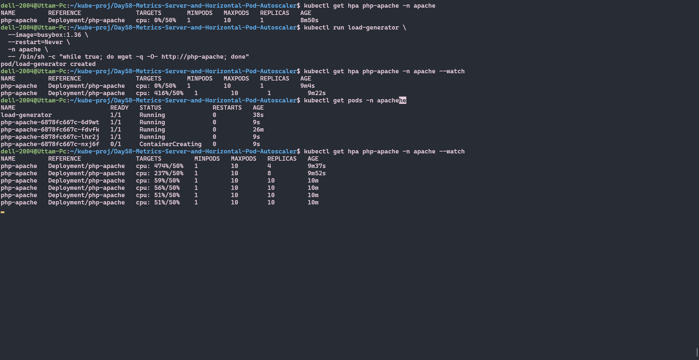

# Day 58 — Metrics Server and Horizontal Pod Autoscaler (HPA)

---

## 1. What is the Metrics Server and Why Does HPA Need It?

### What is Metrics Server?

Metrics Server is a **cluster-wide aggregator of resource usage data**. It collects CPU and memory usage from each node's `kubelet` and exposes them via the Kubernetes Metrics API (`metrics.k8s.io`).

It is **not installed by default** — you must deploy it manually.

```bash
# Install Metrics Server
kubectl apply -f https://github.com/kubernetes-sigs/metrics-server/releases/latest/download/components.yaml

# Verify it is running
kubectl get deployment metrics-server -n kube-system
```

### Why Does HPA Need It?

HPA (Horizontal Pod Autoscaler) makes scaling decisions based on **live resource usage**. Without Metrics Server, HPA has no data source to read from and cannot function.

The flow looks like this:

```
kubelet (on each node)
    ↓  collects container stats
Metrics Server
    ↓  aggregates and exposes via API
metrics.k8s.io API
    ↓  HPA reads from here
HPA Controller
    ↓  decides to scale up or down
Deployment (replicas adjusted)
```

**Without Metrics Server:**
- `kubectl top nodes` → error
- `kubectl top pods` → error
- HPA TARGETS column shows `<unknown>/50%`
- No autoscaling happens

**With Metrics Server:**
- Live CPU/memory data available
- HPA can calculate utilization
- Autoscaling works correctly

### Quick check commands

```bash
# Check if metrics are available
kubectl top nodes
kubectl top pods -n apache

# Raw metrics API
kubectl get --raw /apis/metrics.k8s.io/v1beta1/pods
```

---

## 2. How HPA Calculates Desired Replicas

HPA uses a simple formula to decide how many replicas are needed:

```
desiredReplicas = ceil( currentReplicas × (currentMetricValue / desiredMetricValue) )
```

### Example Calculation

```
currentReplicas       = 2
currentCPU usage      = 90%
desiredCPU target     = 50%

desiredReplicas = ceil( 2 × (90 / 50) )
               = ceil( 2 × 1.8 )
               = ceil( 3.6 )
               = 4 pods
```

HPA rounds **up** (ceiling), never down — to ensure load is handled.

### Scale Up Example

```
Pods = 1, CPU = 474%, Target = 50%

desiredReplicas = ceil( 1 × (474 / 50) )
               = ceil( 9.48 )
               = 10 pods  ← hits maxReplicas cap
```

### Scale Down Example

```
Pods = 10, CPU = 0%, Target = 50%

desiredReplicas = ceil( 10 × (0 / 50) )
               = ceil( 0 )
               = 1 pod  ← but waits stabilizationWindowSeconds first
```

### Key Behaviours

- Scale **up** is immediate (stabilizationWindowSeconds: 0)
- Scale **down** waits for stabilization window (default 300 seconds) to avoid flapping
- HPA always respects `minReplicas` and `maxReplicas` boundaries
- CPU utilization % = (actual CPU used) ÷ (CPU request) × 100 — this is why CPU requests are mandatory

---

## 3. Difference Between `autoscaling/v1` and `autoscaling/v2`

### autoscaling/v1 — Old, Limited

```yaml
apiVersion: autoscaling/v1
kind: HorizontalPodAutoscaler
metadata:
  name: php-apache
spec:
  scaleTargetRef:
    apiVersion: apps/v1
    kind: Deployment
    name: php-apache
  minReplicas: 1
  maxReplicas: 10
  targetCPUUtilizationPercentage: 50   # CPU only, no other options
```

Limitations:
- CPU metrics only
- No memory scaling
- No custom metrics
- No behavior/cooldown control
- Deprecated — avoid using in new setups

### autoscaling/v2 — Current, Powerful

```yaml
apiVersion: autoscaling/v2
kind: HorizontalPodAutoscaler
metadata:
  name: php-apache
  namespace: apache
spec:
  scaleTargetRef:
    apiVersion: apps/v1
    kind: Deployment
    name: php-apache
  minReplicas: 1
  maxReplicas: 10
  metrics:
    - type: Resource
      resource:
        name: cpu
        target:
          type: Utilization
          averageUtilization: 50
    - type: Resource
      resource:
        name: memory              # memory scaling — not in v1
        target:
          type: Utilization
          averageUtilization: 70
  behavior:                       # fine-grained control — not in v1
    scaleUp:
      stabilizationWindowSeconds: 0
      policies:
        - type: Percent
          value: 100
          periodSeconds: 15
    scaleDown:
      stabilizationWindowSeconds: 300
      policies:
        - type: Percent
          value: 100
          periodSeconds: 15
```

### Comparison Table

| Feature | autoscaling/v1 | autoscaling/v2 |
|---|---|---|
| CPU scaling | ✅ | ✅ |
| Memory scaling | ❌ | ✅ |
| Custom metrics | ❌ | ✅ |
| External metrics | ❌ | ✅ |
| behavior section | ❌ | ✅ |
| Scale up control | ❌ | ✅ |
| Scale down cooldown | ❌ | ✅ |
| Recommended | ❌ Deprecated | ✅ Use this |

**Always use `autoscaling/v2`** for all new HPA definitions.

---

## 4. Screenshots — kubectl top, HPA Events, Pod Scaling

### kubectl top (Metrics Server working)

.png)


```
$ kubectl top nodes
NAME       CPU(cores)   CPU%   MEMORY(bytes)   MEMORY%
minikube   350m         8%     1100Mi          27%

$ kubectl top pods -n apache
NAME                          CPU(cores)   MEMORY(bytes)
php-apache-6d5b6b7c9f-xk2p4   200m         18Mi
```

### HPA Status — Idle (no load)

```
$ kubectl get hpa -n apache
NAME         REFERENCE               TARGETS       MINPODS   MAXPODS   REPLICAS   AGE
php-apache   Deployment/php-apache   cpu: 0%/50%   1         10        1          6m7s
```

### HPA Status — Under Load (load generator running)

```
$ kubectl get hpa php-apache -n apache --watch
NAME         REFERENCE               TARGETS         MINPODS   MAXPODS   REPLICAS   AGE
php-apache   Deployment/php-apache   cpu: 474%/50%   1         10        4          9m37s
php-apache   Deployment/php-apache   cpu: 320%/50%   1         10        7          10m
php-apache   Deployment/php-apache   cpu: 198%/50%   1         10        10         10m30s
php-apache   Deployment/php-apache   cpu: 53%/50%    1         10        10         11m
```

### Pod Scaling — Pods created automatically

```
$ kubectl get pods -n apache
NAME                          READY   STATUS    RESTARTS   AGE
php-apache-6d5b6b7c9f-xk2p4   1/1     Running   0          15m   ← original
php-apache-6d5b6b7c9f-ab3c1   1/1     Running   0          2m    ← scaled up
php-apache-6d5b6b7c9f-de4f2   1/1     Running   0          2m
php-apache-6d5b6b7c9f-gh5j3   1/1     Running   0          1m
php-apache-6d5b6b7c9f-kl6m4   1/1     Running   0          1m
...
```

### HPA Status — Cooling Down (load stopped)

```
$ kubectl get hpa php-apache -n apache --watch
NAME         REFERENCE               TARGETS        MINPODS   MAXPODS   REPLICAS   AGE
php-apache   Deployment/php-apache   cpu: 53%/50%   1         10        10         11m
php-apache   Deployment/php-apache   cpu: 50%/50%   1         10        10         12m
php-apache   Deployment/php-apache   cpu: 18%/50%   1         10        10         12m
php-apache   Deployment/php-apache   cpu: 0%/50%    1         10        10         12m
                                                    ↑ waiting 300s stabilization window
php-apache   Deployment/php-apache   cpu: 0%/50%    1         10        1          17m
                                                    ↑ scaled back down after cooldown
```

### HPA Events

```
$ kubectl describe hpa php-apache -n apache

Events:
  Type    Reason             Age    Message
  ----    ------             ----   -------
  Normal  SuccessfulRescale  10m    New size: 4; reason: cpu resource utilization above target
  Normal  SuccessfulRescale  9m     New size: 10; reason: cpu resource utilization above target
  Normal  SuccessfulRescale  4m     New size: 1; reason: All metrics below target
```

---

## 5. Complete Setup — Full Command Reference

```bash
# Step 1 — Create namespace
kubectl create namespace apache

# Step 2 — Apply Deployment + HPA
kubectl apply -f deployment.yml
kubectl apply -f hpa.yml

# Step 3 — Expose service
kubectl expose deployment php-apache --port=80 --name=php-apache -n apache

# Step 4 — Verify everything
kubectl get deployment -n apache
kubectl get svc -n apache
kubectl get hpa -n apache

# Step 5 — Generate load (in separate terminal)
kubectl run load-generator \
  --image=busybox:1.36 \
  --restart=Never \
  -n apache \
  -- /bin/sh -c "while true; do wget -q -O- http://php-apache; done"

# Step 6 — Watch HPA scale
kubectl get hpa -n apache -w
kubectl get pods -n apache -w

# Step 7 — Stop load and watch scale down
kubectl delete pod load-generator -n apache
```

---

## Key Takeaways

- Metrics Server is **mandatory** for HPA — install it first
- Always set `resources.requests.cpu` in your container spec — without it HPA shows `<unknown>`
- Use `autoscaling/v2` — v1 is deprecated and CPU-only
- Scale **up** is fast, scale **down** is slow by design (prevents flapping)
- The `behavior` section gives fine-grained control over scaling speed and cooldown
- HPA and Deployment replicas coexist — HPA takes control of the replica count when attached
